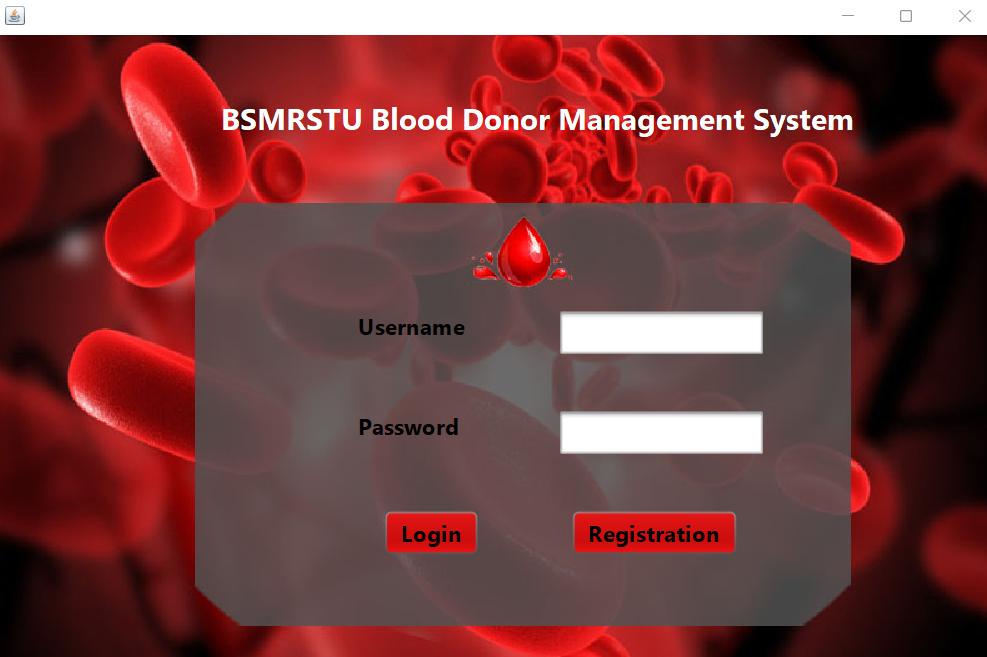
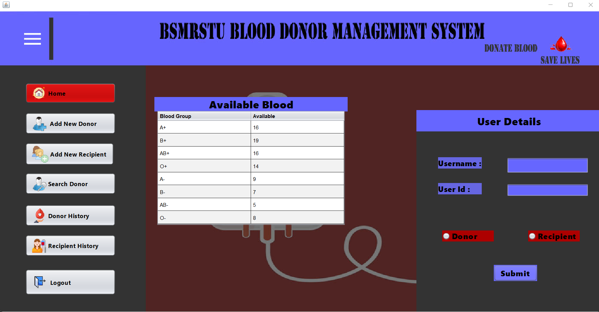
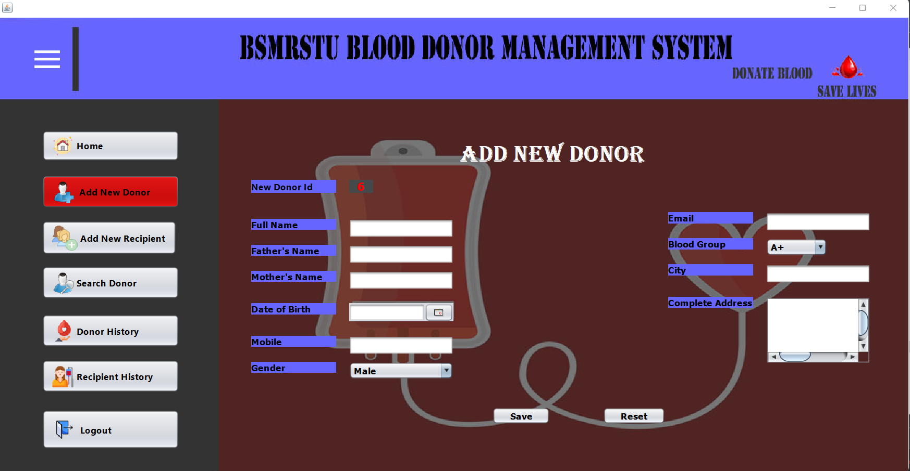
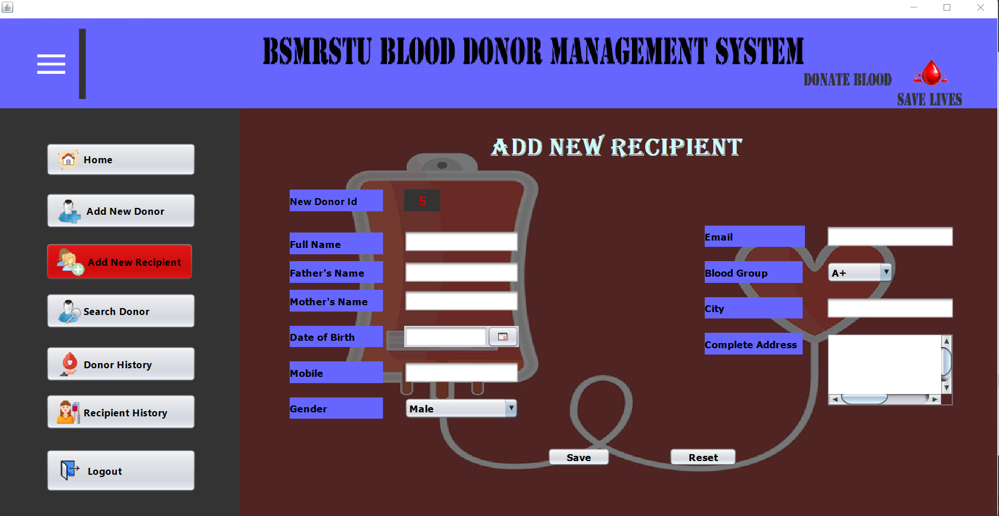
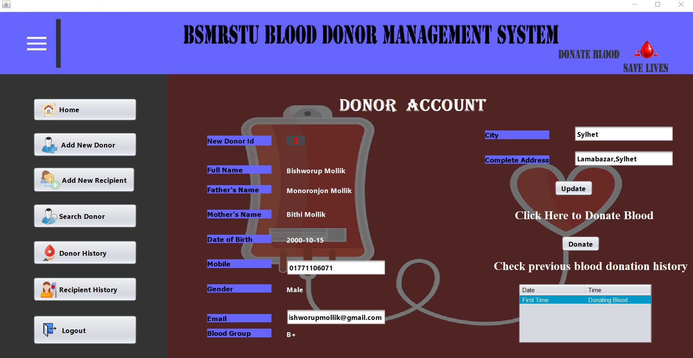
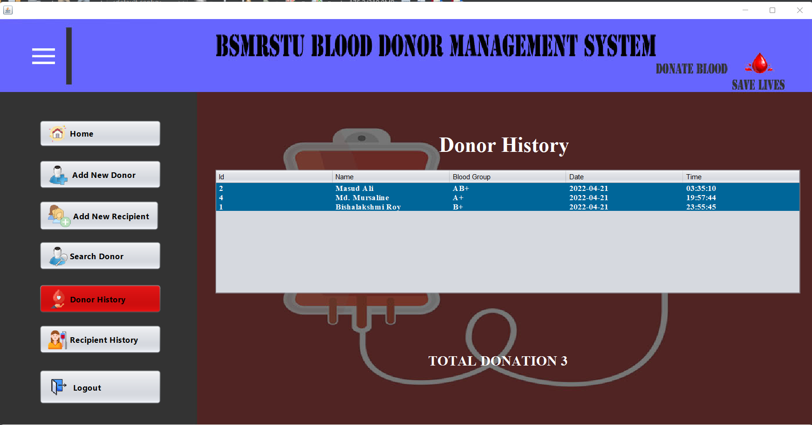
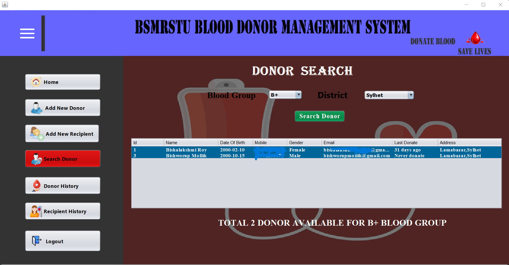

<h1 style="text-align: center;">BLOOD DONATION MANAGEMENT SYSTEM</h1> 
Main vision is to design a systematic blood donor management system and to validate the design using appropriate support. This is a PC-based application. It is implemented by Java Swing and the database is MySQL

# Language and Tools

1. Java ( Swing framework)

2. NetBeans

3. MySQL Database

4. Xampp 

# Snapshots  

